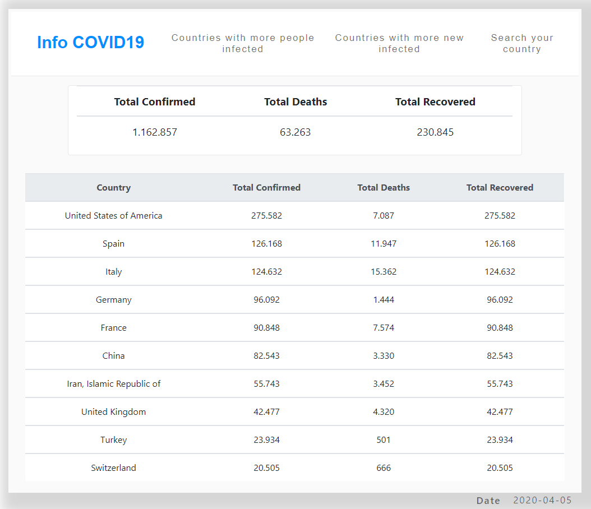
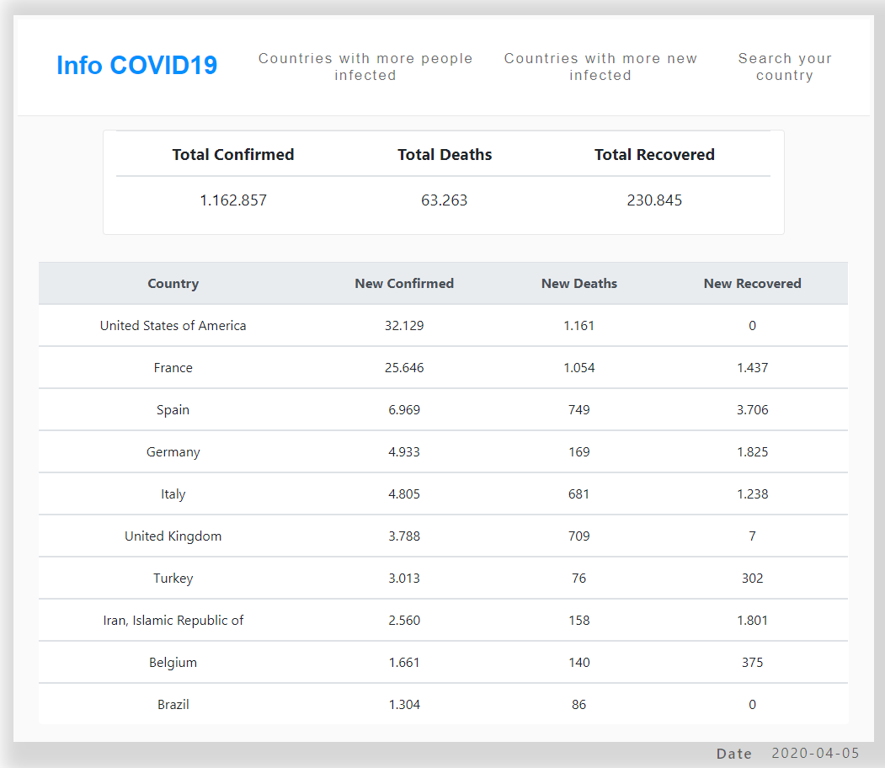
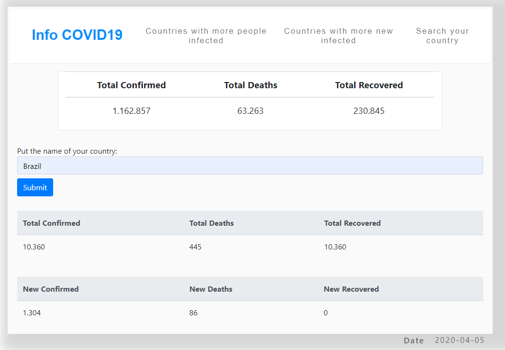

 
<h1 align="center">Info covid19 app</h1>

In this project an application was built that informs about COVID-19, using API, React and Redux.

## Table of Contents

- [About the Project](#about-the-project)
  - [Built With](#built-with)
- [Run This App](#run-this-app)
- [Acknowledgements](#acknowledgements)
- [Contact](#contact)

## About The Project

A project is based on a catalog of statistics. The goal is a catalog that you can filter and access the details of an item. The list must be accessed from an API, the chosen API was <a href="https://covid19api.com/">Coronavirus COVID19 API</a>.

<a href="https://www.notion.so/Catalogue-of-Statistics-72446e7fa33c403a9b6a0bc1de5c6cf5">Project specifications</a>

<a href="https://upbeat-kirch-c70050.netlify.app/">Live version</a>

### Project

#### Countries with more people infected

#### Countries with more new infected

#### Search your country

### Built With
- JavaScript
- React
- Redux
- <a href="https://covid19api.com/">COVID19 API</a>
- CSS
- HTML
- GitHub
- Netlify

## Run This App

- Clone or Download
- Extract the project if you Download
- Go to the folder with your terminal
- Run npm install
- Run npm start

## Acknowledgements

- [Microverse](https://www.microverse.org/)
- [React](https://reactjs.org/)

## Show your support

Give a ⭐️ if you like this project!

## Contact
Felipe Enne Mendes Ribeiro
* Email - felipeenne@gmail.com
* <a href="https://www.linkedin.com/in/felipe-enne/" target="_blank">LinkedIn</a>
* <a href="https://felipeenne.com/" target="_blank">Portfolio</a>
