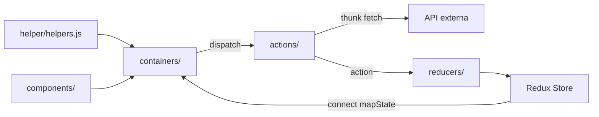

# Arquitetura — Info-covid19-app

## Visão geral

O projeto é uma **Single Page Application (SPA)** puramente frontend. Não existe camada de servidor, API própria, banco de dados ou workers. A aplicação roda inteiramente no navegador e consome uma API pública externa para obter dados de COVID-19.

```
┌─────────────────────────────────────────────────────────┐
│                      Navegador                          │
│  ┌─────────────┐    ┌──────────────┐    ┌────────────┐ │
│  │  React UI   │◄──►│  Redux Store │◄──►│  Thunks    │ │
│  │ (components │    │  (3 slices)  │    │  (actions) │ │
│  │ + containers)│  └──────────────┘    └─────┬──────┘ │
│  └─────────────┘                               │ fetch  │
└────────────────────────────────────────────────┼────────┘
                                                 ▼
                                    ┌────────────────────────┐
                                    │ api.covid19api.com     │
                                    │ GET /summary           │
                                    └────────────────────────┘
```

**Deploy:** build estático (`npm run build`) servido pelo Netlify.

---

## Padrão arquitetural

### Container / Presentational + Redux clássico

| Camada | Localização | Papel |
|--------|-------------|-------|
| Presentational | `src/components/` | Renderização pura; recebe props |
| Container | `src/containers/` | Conecta ao Redux via `connect()`; dispara actions; contém lógica de renderização condicional |
| Actions | `src/actions/` | Action creators e thunks assíncronos |
| Reducers | `src/reducers/` | Funções puras que atualizam o estado |
| Helpers | `src/helper/` | Utilitários compartilhados (sort, format) |

Não há camada de serviço (`services/`) nem repositório. A chamada HTTP está diretamente no thunk `fetchSummary`.

---

## Como os módulos se comunicam



### Fluxo típico de uma requisição

1. Container monta (`useEffect`) e dispara `fetchSummary()`.
2. Thunk em `fechSummary.js` dispara `FETCH_PRODUCTS_LOADING`.
3. `fetch()` chama `https://api.covid19api.com/summary`.
4. Em sucesso: `FETCH_PRODUCTS_SUCCESS` com payload JSON.
5. Reducer `summary.js` atualiza `state.summary.resp`.
6. Container re-renderiza com novos dados via `mapStateToProps`.

---

## Estado global (Redux Store)

Definido em `src/reducers/index.js`:

| Slice | Reducer | Conteúdo |
|-------|---------|----------|
| `summary` | `summary.js` | `{ loading, resp, error }` — dados da API |
| `country` | `selectCountry.js` | `{ country }` — país selecionado na busca |
| `filter` | `filterInfoReducer.js` | `{ filter }` — critério de ordenação ativo |

Middleware: `redux-thunk` (único).

**Estado inicial:** `initialState.js` contém um snapshot estático de junho/2020 usado como fallback até o fetch completar.

---

## Onde ficam as regras de negócio

| Regra | Local |
|-------|-------|
| Busca de dados | `src/actions/fechSummary.js` |
| Ordenação de países | `src/helper/helpers.js` (`sortTotalConfirmed`, etc.) |
| Seleção do top 10 | `src/helper/helpers.js` (`getTenArray`) |
| Critério de filtro ativo | `src/reducers/filterInfoReducer.js` + `src/actions/updateFilter.js` |
| Lógica de exibição condicional | Containers (`shouldComponentRender` inline) |
| Busca por país | `src/containers/SearchCountry.js` (`handleClick` + `resp.find`) |

Não há validação formal de entrada além de checagens básicas no container de busca.

---

## Integrações externas

| Integração | Tipo | Arquivo / referência |
|------------|------|----------------------|
| COVID-19 API | REST pública | `src/actions/fechSummary.js` |
| Netlify | Hosting estático | `README.md` |
| Bootstrap CDN/CSS | UI framework | `src/components/App.js` (import CSS) |
| GitHub Actions | CI (lint only) | `.github/linters.yml` |
| Stickler CI | Lint em PRs | `.stickler.yml` |

Não há integrações com Firebase, analytics, pagamentos ou serviços de autenticação.

---

## Rotas (React Router)

Definidas em `src/components/App.js`:

| Rota | Componente | Descrição |
|------|------------|-----------|
| `/` | `MoreInfected` | Top 10 por totais (confirmados, mortes, recuperados) |
| `/new` | `MoreNewInfected` | Top 10 por novos casos |
| `/seach` | `SearchCountry` | Busca por nome de país |

O componente `Summary` é renderizado **fora** do `<Switch>`, portanto aparece em todas as rotas.

---

## Problemas arquiteturais identificados

### 1. Mutação de estado Redux

As funções `sort*` em `helpers.js` chamam `array.sort()` diretamente no array `Countries` vindo do store, mutando o estado em vez de criar cópia. Isso viola o princípio de imutabilidade do Redux e pode causar bugs sutis de re-render.

### 2. Fetch duplicado

`Summary` e o container da rota ativa disparam `fetchSummary()` independentemente no `useEffect`. Isso gera duas requisições HTTP idênticas a cada navegação/mount.

### 3. URL da API hardcoded

A URL `https://api.covid19api.com/summary` está fixa no código. Não há variável de ambiente (`REACT_APP_*`) nem camada de configuração.

### 4. Nomenclatura inconsistente

Actions e selectors usam prefixo `fetchProducts*` / `getProducts*` para dados de COVID-19. O arquivo de fetch se chama `fechSummary.js` (typo). Isso dificulta manutenção.

### 5. Código morto no reducer de filtro

`filterInfoReducer.js` define cases `FETCH_PRODUCTS_PENDING/SUCCESS/ERROR` que nunca são disparados por nenhuma action.

### 6. Dependências não utilizadas

`@reduxjs/toolkit` e `react-check-auth` estão no `package.json` sem uso no código.

### 7. API externa descontinuada

A Coronavirus COVID19 API foi descontinuada (~2022). O app depende exclusivamente dela e não tem fallback funcional além do mock estático inicial.

---

## Sugestões futuras de melhoria (sem alterar código agora)

| Área | Sugestão |
|------|----------|
| API | Migrar para API alternativa (ex.: disease.sh) e externalizar URL via `REACT_APP_API_URL` |
| Estado | Corrigir mutações com spread/copy antes de sort; considerar Redux Toolkit |
| Fetch | Centralizar fetch em um único ponto (ex.: apenas no `App` ou middleware) |
| Camada de serviço | Extrair `src/services/covidApi.js` para isolar HTTP |
| Toolchain | Atualizar CRA/React/Node para versões suportadas |
| Testes | Incluir `npm test` no CI |
| Erros | Exibir mensagens de erro na UI quando a API falhar |
| TypeScript | Avaliar migração gradual para tipagem estática |
