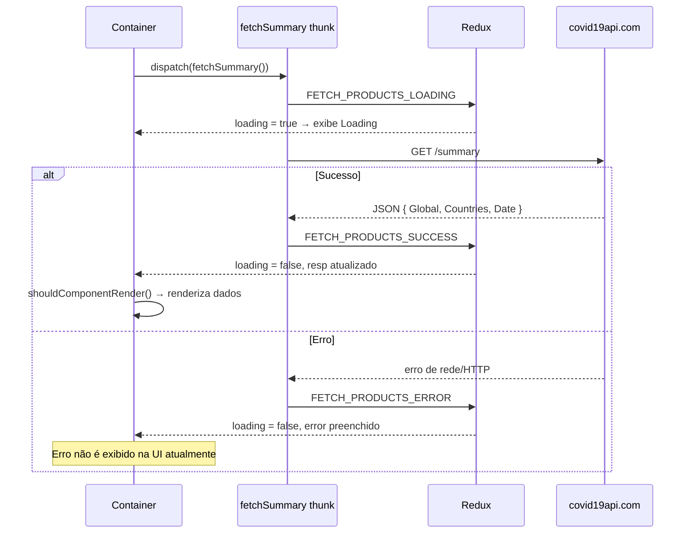
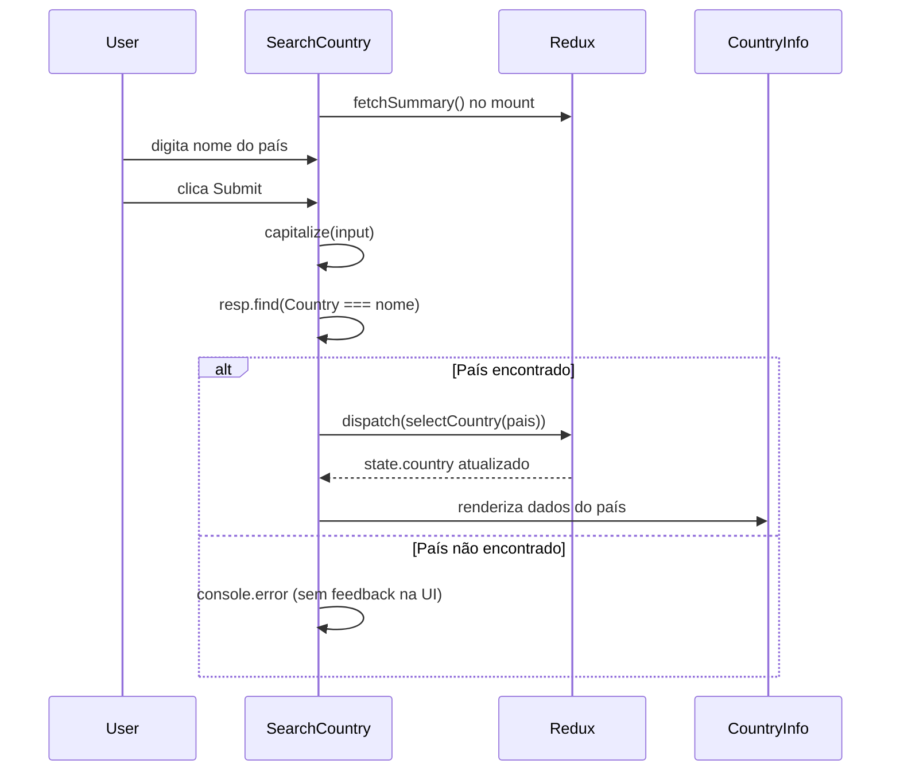

# Fluxos do Sistema — Info-covid19-app

Mapeamento dos principais fluxos de negócio e interação do usuário.

---

## Login / Autenticação

**Não implementado.**

- Não há tela de login, registro ou logout.
- Não há rotas protegidas.
- A dependência `react-check-auth` está no `package.json` mas **não é usada** em nenhum arquivo de `src/`.
- Não há tokens, sessões ou cookies de autenticação.

**A confirmar:** se autenticação foi planejada e abandonada durante o desenvolvimento.

---

## Cadastro

**Não aplicável.** O projeto não possui fluxo de cadastro de usuários.

---

## Fluxo principal: carregamento de dados

Disparado ao montar `Summary` e os containers de rota.



### Arquivos envolvidos

| Etapa | Arquivo |
|-------|---------|
| Disparo | `src/containers/Summary.js`, `MoreInfected.js`, `MoreNewInfected.js`, `SearchCountry.js` |
| Thunk | `src/actions/fechSummary.js` |
| Actions | `src/actions/loader.js` |
| Reducer | `src/reducers/summary.js` |
| Estado inicial | `src/reducers/initialState.js` |
| Loading UI | `src/components/loading.js` |

### Observação: fetch duplicado

Tanto `Summary` quanto o container da rota ativa disparam `fetchSummary()` no `useEffect`. Isso resulta em **duas requisições HTTP idênticas** a cada carregamento de página.

---

## Fluxo: resumo global (sempre visível)

**Rota:** presente em todas as páginas (renderizado fora do `<Switch>`).

1. `Summary` monta e dispara `fetchSummary()`.
2. Enquanto `loading === true` ou `resp` vazio → exibe `<Loading />`.
3. Após sucesso, lê `state.summary.resp.Global`.
4. Formata números com `numberFormat()` e exibe via `<SummaryInfo />`.

**Dados exibidos:** Total Confirmed, Total Deaths, Total Recovered (globais).

---

## Fluxo: países com mais infectados

**Rota:** `/` → `MoreInfected`

1. Monta e dispara `fetchSummary()`.
2. Aguarda dados (`loading` false, `resp` com países).
3. Lê filtro ativo de `state.filter.filter` (padrão: `Total Confirmed`).
4. Ordena array `Countries` conforme filtro:
   - `Total Confirmed` → `sortTotalConfirmed()`
   - `Total Deaths` → `sortTotalDeaths()`
   - `Total Recovered` → `sortTotalRecovered()`
5. Seleciona os 10 últimos do array ordenado (`getTenArray`).
6. Renderiza tabela com `<CountryTag />` para cada país.
7. Exibe data da API no `<FooterApp />`.

### Alteração de filtro

1. Usuário muda `<select>` em `<FilterMoreInfected />`.
2. `handleFilterChange` dispara `updateFilter(value)`.
3. Reducer `filterInfoReducer` atualiza `state.filter.filter`.
4. Container re-renderiza com nova ordenação.

---

## Fluxo: países com mais novos infectados

**Rota:** `/new` → `MoreNewInfected`

Idêntico ao fluxo anterior, mas:

- Filtros: `New Confirmed`, `New Deaths`, `New Recovered`
- Funções de sort: `sortNewConfirmed`, `sortNewDeaths`, `sortNewRecovered`
- Componente de linha: `<CountryNewTag />`
- Filtro UI: `<FilterNewInfected />`

---

## Fluxo: busca por país

**Rota:** `/seach` → `SearchCountry` (typo intencional no path)



### Detalhes

- Input acessado via `document.getElementById('nameCountry')` (não controlado por React state).
- Nome capitalizado com `capitalize()` antes da busca.
- Busca exata por `Country` (case-sensitive após capitalize).
- País selecionado armazenado em `state.country.country`.
- Se país encontrado, exibe `<CountryInfo value={country} />`.

### Limitações

- Sem autocomplete ou sugestões.
- Sem mensagem de erro visível ao usuário (apenas `console.error`).
- Nome deve corresponder exatamente ao campo `Country` da API (ex.: `Brazil`, não `Brasil`).

---

## Fluxo de dados (visão geral)

```
API Externa
    │
    ▼
fetchSummary (thunk)
    │
    ▼
summary reducer ──► state.summary.resp
    │                      │
    │                      ├──► Summary (Global)
    │                      ├──► MoreInfected (Countries + filter)
    │                      ├──► MoreNewInfected (Countries + filter)
    │                      └──► SearchCountry (Countries + busca)
    │
updateFilter ──► filter reducer ──► critério de ordenação
    │
selectCountry ──► country reducer ──► país selecionado
```

---

## Chamadas de API

| Método | URL | Autenticação | Arquivo |
|--------|-----|--------------|---------|
| GET | `https://api.covid19api.com/summary` | Nenhuma | `src/actions/fechSummary.js` |

**Resposta esperada (estrutura):**

```json
{
  "Global": {
    "NewConfirmed": 0,
    "TotalConfirmed": 0,
    "NewDeaths": 0,
    "TotalDeaths": 0,
    "NewRecovered": 0,
    "TotalRecovered": 0
  },
  "Countries": [
    {
      "Country": "Brazil",
      "CountryCode": "BR",
      "Slug": "brazil",
      "NewConfirmed": 0,
      "TotalConfirmed": 0,
      "NewDeaths": 0,
      "TotalDeaths": 0,
      "NewRecovered": 0,
      "TotalRecovered": 0,
      "Date": "2020-06-08T18:20:35Z"
    }
  ],
  "Date": "2020-06-08T18:20:35Z"
}
```

**Status da API:** descontinuada (~2022). A confirmar se ainda responde.

---

## Integrações

| Integração | Fluxo |
|------------|-------|
| COVID-19 API | Única fonte de dados em tempo real |
| Netlify | Deploy estático do build CRA |
| Bootstrap | Estilos carregados via import CSS no App |

Não há webhooks, filas, e-mail ou outros serviços externos.

---

## Navegação

Definida em `src/components/NavbarApp.js`:

| Link | Destino |
|------|---------|
| Countries with more people infected | `/` |
| Countries with more new infected | `/new` |
| Search your country | `/seach` |

O resumo global (`Summary`) permanece visível em todas as rotas.
